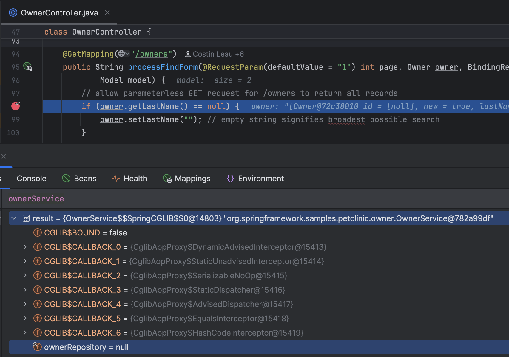

# CGLIB Proxies Test Case

1. Import the project
2. Run automatically created Spring Boot run configuration
3. Set a breakpoint on any line inside the `OwnerController.processFindForm` method
4. Execute an HTTP request from the `cglib-test.http` file
5. Evaluate `ownerService` in the debugger tool window:

